# Firefly Common Platform Config Management


A microservice component of the Firefly Platform for managing configuration and process definitions for a core banking platform, supporting both standalone operation and Banking as a Service (BaaS) modes.

## Table of Contents

- [Overview](#overview)
- [Features](#features)
- [Architecture](#architecture)
- [Data Model](#data-model)
- [API Documentation](#api-documentation)
- [Getting Started](#getting-started)
  - [Prerequisites](#prerequisites)
  - [Installation](#installation)
  - [Configuration](#configuration)
  - [Running the Application](#running-the-application)
- [Development](#development)
  - [Project Structure](#project-structure)
  - [Building](#building)
  - [Testing](#testing)
- [Deployment](#deployment)
- [Contributing](#contributing)
- [License](#license)

## Overview

The Firefly Common Platform Config Management microservice provides a centralized configuration management platform for the Firefly core banking system. It manages provider types, providers, configurations, and processes to support different operational modes (standalone or Banking as a Service).

This microservice enables the Firefly orchestration microservice to determine whether to operate standalone through payment gateways (such as Iberpay in Spain) or use a Banking as a Service provider (like Treezor). The processes that the orchestrator must run differ completely between these scenarios, but this platform also allows for common processes between providers.

## Features

- **Provider Management**: Create and manage different types of providers (BaaS, Payment Gateway, CRM, etc.)
- **Configuration Management**: Store and retrieve provider-specific configurations
- **Process Definition**: Define and version BPMN processes for different providers
- **Reactive API**: Built with Spring WebFlux for non-blocking reactive operations using Mono types
- **Database Independence**: Uses R2DBC for reactive database access
- **Versioning**: Supports versioning of process definitions
- **Hierarchical API**: RESTful API with nested resources

## Architecture

The application follows a clean architecture approach with the following layers:

- **Web Layer**: REST controllers for handling HTTP requests
- **Service Layer**: Business logic and service implementations
- **Repository Layer**: Data access using R2DBC repositories
- **Model Layer**: Domain entities and DTOs

The application is built using:

- **Spring Boot**: Application framework
- **Spring WebFlux**: Reactive web framework
- **Spring Data R2DBC**: Reactive database access
- **PostgreSQL**: Database
- **MapStruct**: Object mapping
- **Lombok**: Boilerplate code reduction

## Data Model

The core entities in the system are:

- **ProviderType**: Types of providers (BaaS, Payment Gateway, CRM)
- **ProviderStatus**: Status of providers (Active, Inactive, etc.)
- **Provider**: Provider details and configuration
- **ProviderConfig**: Configuration settings for providers
- **ProviderProcessStatus**: Status of processes (Draft, Published, etc.)
- **ProviderProcess**: Process definitions for providers
- **ProviderProcessVersion**: Versioned BPMN process definitions

### Entity Relationship Diagram

```mermaid
erDiagram
    ProviderType ||--o{ Provider : "has many"
    ProviderStatus ||--o{ Provider : "has many"
    Provider ||--o{ ProviderConfig : "has many"
    Provider ||--o{ ProviderProcess : "has many"
    ProviderProcessStatus ||--o{ ProviderProcessVersion : "has many"
    ProviderProcess ||--o{ ProviderProcessVersion : "has many"

    ProviderType {
        Long id PK
        String code
        String name
        String description
        Boolean active
        Long version
        LocalDateTime createdAt
        LocalDateTime updatedAt
    }

    ProviderStatus {
        Long id PK
        String code
        String name
        String description
        Boolean active
        Long version
        LocalDateTime createdAt
        LocalDateTime updatedAt
    }

    Provider {
        Long id PK
        String code
        String name
        String description
        Long providerTypeId FK
        Long providerStatusId FK
        String apiBaseUrl
        String webhookUrl
        String callbackUrl
        String logoUrl
        String documentationUrl
        String supportUrl
        String contactName
        String contactEmail
        String contactPhone
        String technicalContactName
        String technicalContactEmail
        String technicalContactPhone
        String countryCode
        String region
        String timezone
        String currencyCode
        Integer maxRequestsPerSecond
        Integer maxConcurrentRequests
        Boolean requiresAuthentication
        String authenticationType
        Boolean supportsWebhooks
        Boolean supportsCallbacks
        Boolean supportsPolling
        Integer pollingIntervalSeconds
        Boolean active
        Long version
        LocalDateTime createdAt
        LocalDateTime updatedAt
    }

    ProviderConfig {
        Long id PK
        Long providerId FK
        String configGroup
        String key
        String value
        String valueType
        String description
        Boolean isSecret
        Boolean isRequired
        Boolean isEditable
        String validationRegex
        String defaultValue
        String environment
        LocalDateTime expirationDate
        String tags
        String metadata
        Integer orderIndex
        Boolean active
        Long version
        LocalDateTime createdAt
        LocalDateTime updatedAt
    }

    ProviderProcessStatus {
        Long id PK
        String code
        String name
        String description
        Boolean active
        Long version
        LocalDateTime createdAt
        LocalDateTime updatedAt
    }

    ProviderProcess {
        Long id PK
        String code
        String name
        String description
        Long providerId FK
        String processType
        String processCategory
        Boolean isCommon
        Integer priority
        Integer estimatedDurationSeconds
        String tags
        String metadata
        Boolean active
        Long version
        LocalDateTime createdAt
        LocalDateTime updatedAt
    }

    ProviderProcessVersion {
        Long id PK
        Long providerProcessId FK
        String version
        String bpmnXml
        String bpmnDiagramXml
        Long providerProcessStatusId FK
        String notes
        String changelog
        String deployedBy
        LocalDateTime deployedAt
        Boolean isCurrent
        Boolean isDeployed
        String deploymentId
        Boolean active
        Long versionNumber
        LocalDateTime createdAt
        LocalDateTime updatedAt
    }
```



## API Documentation

The API follows RESTful principles with nested resources. All endpoints return reactive `Mono` types, including `Mono<PaginationResponse<T>>` for paginated results.

Base URL: `/api/v1`

### Main Resources

- `/api/v1/provider-types`: Provider types management
- `/api/v1/provider-statuses`: Provider statuses management
- `/api/v1/providers`: Provider management
- `/api/v1/provider-process-statuses`: Process statuses management
- `/api/v1/processes`: Process management
- `/api/v1/process-versions`: Process versions management

### Nested Resources

- `/api/v1/providers/{providerId}/configs`: Provider configurations
- `/api/v1/providers/{providerId}/processes`: Provider processes
- `/api/v1/processes/{processId}/versions`: Process versions

For detailed API documentation, see the Swagger UI at `/swagger-ui.html` when the application is running.

## Getting Started

### Prerequisites

- Java 21 or higher
- Maven 3.8 or higher
- PostgreSQL 13 or higher
- Docker (optional, for containerized deployment)

### Installation

1. Clone the repository:
   ```bash
   git clone https://github.com/firefly/common-platform-config-mgmt.git
   cd common-platform-config-mgmt
   ```

2. Build the application:
   ```bash
   mvn clean install
   ```

### Configuration

Configuration is managed through application properties files:

- `application.yml`: Common configuration
- `application-dev.yml`: Development environment configuration
- `application-prod.yml`: Production environment configuration

Key configuration properties:

```yaml
spring:
  r2dbc:
    url: r2dbc:postgresql://localhost:5432/config_mgmt
    username: postgres
    password: postgres
  flyway:
    url: jdbc:postgresql://localhost:5432/config_mgmt
    user: postgres
    password: postgres
```

### Running the Application

#### Local Development

```bash
mvn spring-boot:run -Dspring-boot.run.profiles=dev
```

#### Using Docker

```bash
docker build -t common-platform-config-mgmt .
docker run -p 8080:8080 common-platform-config-mgmt
```

#### Using Docker Compose

```bash
docker-compose up
```

## Development

### Project Structure

```
common-platform-config-mgmt/
├── common-platform-config-mgmt-models/       # Domain models and repositories
├── common-platform-config-mgmt-core/         # Business logic and services
├── common-platform-config-mgmt-interfaces/   # DTOs and interfaces
├── common-platform-config-mgmt-web/          # Web controllers and configuration
├── docs/                                     # Documentation
└── scripts/                                  # Utility scripts
```

### Building

```bash
mvn clean install
```

### Testing

```bash
# Run all tests
mvn test

# Run specific test
mvn test -Dtest=ProviderServiceTest
```

## Deployment

### Kubernetes

Kubernetes deployment files are available in the `k8s` directory.

```bash
kubectl apply -f k8s/deployment.yaml
kubectl apply -f k8s/service.yaml
```

### Cloud Deployment

For cloud deployment, follow the specific guidelines for your cloud provider.

## Contributing

1. Fork the repository
2. Create a feature branch (`git checkout -b feature/amazing-feature`)
3. Commit your changes (`git commit -m 'Add some amazing feature'`)
4. Push to the branch (`git push origin feature/amazing-feature`)
5. Open a Pull Request

## License

This project is licensed under the Apache License 2.0 - see the LICENSE file for details.

```
Copyright 2023 Firefly

Licensed under the Apache License, Version 2.0 (the "License");
you may not use this file except in compliance with the License.
You may obtain a copy of the License at

    http://www.apache.org/licenses/LICENSE-2.0

Unless required by applicable law or agreed to in writing, software
distributed under the License is distributed on an "AS IS" BASIS,
WITHOUT WARRANTIES OR CONDITIONS OF ANY KIND, either express or implied.
See the License for the specific language governing permissions and
limitations under the License.
```

---

© 2023 Firefly. All Rights Reserved.