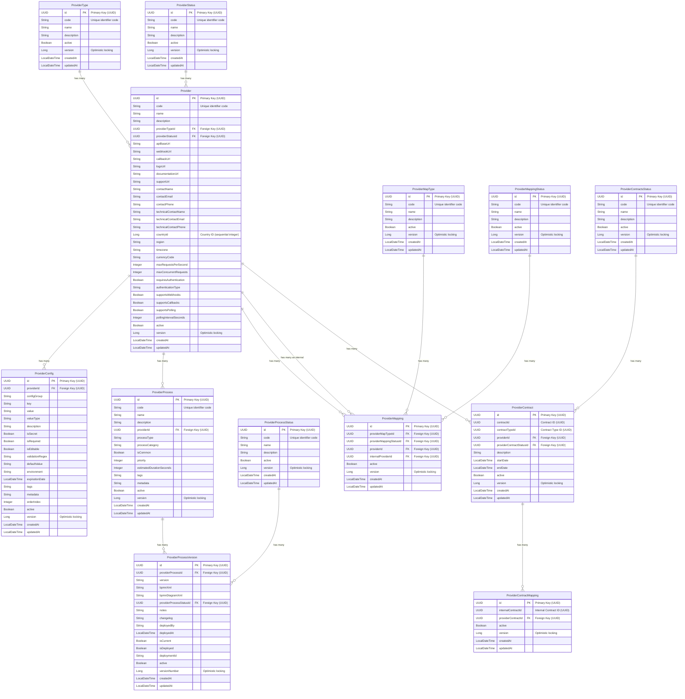

# Firefly Common Platform Config Management


A microservice component of the Firefly Platform for managing configuration and process definitions for a core banking platform, supporting both standalone operation and Banking as a Service (BaaS) modes. This service provides a centralized configuration management system that enables the Firefly orchestration microservice to determine whether to operate standalone through payment gateways or use a Banking as a Service provider.

## Table of Contents

- [Overview](#overview)
- [Features](#features)
- [Architecture](#architecture)
- [Data Model](#data-model)
- [API Documentation](#api-documentation)
  - [API Examples](#api-examples)
- [Getting Started](#getting-started)
  - [Prerequisites](#prerequisites)
  - [Installation](#installation)
  - [Configuration](#configuration)
  - [Running the Application](#running-the-application)
- [Step-by-Step Guide](#step-by-step-guide)
  - [Setting Up Provider Types](#setting-up-provider-types)
  - [Creating Provider Statuses](#creating-provider-statuses)
  - [Configuring a Provider](#configuring-a-provider)
  - [Managing Provider Configurations](#managing-provider-configurations)
  - [Creating Process Statuses](#creating-process-statuses)
  - [Defining Provider Processes](#defining-provider-processes)
  - [Managing Process Versions](#managing-process-versions)
  - [Validating and Deploying Processes](#validating-and-deploying-processes)
- [Development](#development)
  - [Project Structure](#project-structure)
  - [Building](#building)
  - [Testing](#testing)
- [Deployment](#deployment)
- [Contributing](#contributing)
- [License](#license)

## Overview

The Firefly Common Platform Config Management microservice provides a centralized configuration management platform for the Firefly core banking system. It manages provider types, providers, configurations, and processes to support different operational modes (standalone or Banking as a Service).

This microservice enables the Firefly orchestration microservice to determine whether to operate standalone through payment gateways (such as Iberpay in Spain) or use a Banking as a Service provider (like Treezor). The processes that the orchestrator must run differ completely between these scenarios, but this platform also allows for common processes between providers.

## Features

- **Provider Management**: Create and manage different types of providers (BaaS, Payment Gateway, CRM, etc.)
- **Configuration Management**: Store and retrieve provider-specific configurations
- **Process Definition**: Define and version BPMN processes for different providers
- **Reactive API**: Built with Spring WebFlux for non-blocking reactive operations using Mono types
- **Database Independence**: Uses R2DBC for reactive database access
- **Versioning**: Supports versioning of process definitions
- **Hierarchical API**: RESTful API with nested resources

## Architecture

The application follows a clean architecture approach with the following layers:

- **Web Layer**: REST controllers for handling HTTP requests
- **Service Layer**: Business logic and service implementations
- **Repository Layer**: Data access using R2DBC repositories
- **Model Layer**: Domain entities and DTOs

The application is built using:

- **Spring Boot**: Application framework
- **Spring WebFlux**: Reactive web framework
- **Spring Data R2DBC**: Reactive database access
- **PostgreSQL**: Database
- **MapStruct**: Object mapping
- **Lombok**: Boilerplate code reduction

## Data Model

The core entities in the system are:

- **ProviderType**: Types of providers (BaaS, Payment Gateway, CRM)
- **ProviderStatus**: Status of providers (Active, Inactive, etc.)
- **Provider**: Provider details and configuration
- **ProviderConfig**: Configuration settings for providers
- **ProviderProcessStatus**: Status of processes (Draft, Published, etc.)
- **ProviderProcess**: Process definitions for providers
- **ProviderProcessVersion**: Versioned BPMN process definitions
- **ProviderMappingStatus**: Status of provider mappings (Active, Inactive, etc.)
- **ProviderMapType**: Types of provider mappings
- **ProviderMapping**: Mappings between providers
- **ProviderContractsStatus**: Status of provider contracts (Active, Expired, etc.)
- **ProviderContract**: Contracts associated with providers
- **ProviderContractMapping**: Mappings between internal contracts and provider contracts

### UUID Strategy

This system uses UUIDs (Universally Unique Identifiers) as primary keys for all entities. This design choice provides several benefits and is consistently implemented across the database schema, API layer, and application code.

#### Benefits of UUID Primary Keys

1. **Global Uniqueness**: UUIDs are globally unique, eliminating ID conflicts when merging data from different environments or database instances
2. **Distributed Systems Support**: No need for centralized sequence coordination across multiple database instances
3. **Enhanced Security**: Non-sequential IDs make it harder to guess valid identifiers
4. **Better Distribution**: UUIDs provide better distribution in sharded or partitioned databases
5. **Environment Independence**: Data can be safely moved between development, staging, and production environments
6. **Microservices Friendly**: Each service can generate its own IDs without coordination

#### UUID Implementation Across Layers

##### Database Layer
The system uses PostgreSQL's `uuid-ossp` extension with the `uuid_generate_v4()` function:

```sql
-- Enable UUID extension (automatically included in migrations)
CREATE EXTENSION IF NOT EXISTS "uuid-ossp";

-- All tables use UUID primary keys
CREATE TABLE provider_types (
    id UUID PRIMARY KEY,
    code VARCHAR(50) NOT NULL UNIQUE,
    -- other columns...
);

-- Generate UUIDs for new records
INSERT INTO provider_types (id, code, name, description, active)
VALUES (uuid_generate_v4(), 'BAAS', 'Banking as a Service', 'Description', true);
```

##### Application Layer
Java entities use `java.util.UUID` type:

```java
@Entity
@Table("providers")
public class Provider {
    @Id
    private UUID id;

    @Column("provider_type_id")
    private UUID providerTypeId;

    // other fields...
}
```

##### API Layer
All REST endpoints use UUID format for entity identifiers:

```bash
# API endpoint examples
GET /api/v1/providers/550e8400-e29b-41d4-a716-446655440000
POST /api/v1/provider-configs
{
  "providerId": "550e8400-e29b-41d4-a716-446655440000",
  "key": "API_KEY",
  "value": "secret-value"
}
```

#### Foreign Key Relationships

All foreign key relationships use UUIDs to maintain referential integrity:

```sql
-- Foreign keys reference UUID primary keys
CREATE TABLE providers (
    id UUID PRIMARY KEY,
    provider_type_id UUID NOT NULL REFERENCES provider_types(id),
    provider_status_id UUID NOT NULL REFERENCES provider_statuses(id),
    -- other columns...
);
```

#### Exception: Country IDs

Country IDs are the only exception to the UUID strategy and use sequential integer identifiers:

```sql
-- Country IDs use BIGINT for simplicity and performance
ALTER TABLE providers ADD COLUMN countryId BIGINT;
```

This design choice was made for:
- **Performance**: Faster lookups for geographical data
- **Simplicity**: Easier integration with external geographical services
- **Compatibility**: Standard practice for country/region identifiers

#### UUID Best Practices

##### Development Guidelines
- **Always use `java.util.UUID`** type in Java entities and DTOs
- **Repository methods** should accept and return UUID parameters
- **REST APIs** must accept UUID strings in standard format: `550e8400-e29b-41d4-a716-446655440000`
- **Validate UUID format** in API endpoints before database operations
- **Use SELECT statements** in migrations for foreign key references

##### Testing Considerations
```java
// Good: Generate proper UUIDs for tests
UUID providerId = UUID.randomUUID();
Provider provider = Provider.builder()
    .id(providerId)
    .code("TEST_PROVIDER")
    .build();

// For consistent test data, use fixed UUIDs
public static final UUID BAAS_PROVIDER_TYPE_ID =
    UUID.fromString("550e8400-e29b-41d4-a716-446655440000");
```

##### API Usage Examples
```bash
# Correct API usage
GET /api/v1/providers/550e8400-e29b-41d4-a716-446655440000
PUT /api/v1/providers/550e8400-e29b-41d4-a716-446655440000
DELETE /api/v1/providers/550e8400-e29b-41d4-a716-446655440000

# Request body with UUIDs
POST /api/v1/provider-configs
{
  "providerId": "550e8400-e29b-41d4-a716-446655440000",
  "key": "API_KEY",
  "value": "secret-value"
}
```

For comprehensive UUID implementation details, see [UUID Best Practices Guide](docs/UUID_BEST_PRACTICES.md).

### Entity Relationship Diagram



## API Documentation

The API follows RESTful principles with nested resources and uses UUIDs for all entity identifiers. All endpoints return reactive `Mono` types, including `Mono<PaginationResponse<T>>` for paginated results.

Base URL: `/api/v1`

### UUID Usage in APIs

All entity identifiers in the API use UUID format. Examples:

```bash
# Provider management with UUIDs
GET /api/v1/providers/550e8400-e29b-41d4-a716-446655440000
PUT /api/v1/providers/550e8400-e29b-41d4-a716-446655440000
DELETE /api/v1/providers/550e8400-e29b-41d4-a716-446655440000

# Nested resources with UUIDs
GET /api/v1/providers/550e8400-e29b-41d4-a716-446655440000/configs
POST /api/v1/providers/550e8400-e29b-41d4-a716-446655440000/processes
GET /api/v1/processes/6ba7b810-9dad-11d1-80b4-00c04fd430c8/versions
```

### Main Resources

- `/api/v1/provider-types`: Provider types management
- `/api/v1/provider-statuses`: Provider statuses management
- `/api/v1/providers`: Provider management
- `/api/v1/provider-process-statuses`: Process statuses management
- `/api/v1/processes`: Process management
- `/api/v1/provider-mappings`: Provider mappings management
- `/api/v1/provider-contracts`: Provider contracts management

### Nested Resources

- `/api/v1/providers/{providerId}/configs`: Provider configurations (providerId is UUID)
- `/api/v1/providers/{providerId}/processes`: Provider processes (providerId is UUID)
- `/api/v1/processes/{processId}/versions`: Process versions (processId is UUID)

### Request/Response Format

All API requests and responses use UUID strings in standard format:

```json
{
  "id": "550e8400-e29b-41d4-a716-446655440000",
  "code": "TREEZOR",
  "name": "Treezor",
  "providerTypeId": "6ba7b810-9dad-11d1-80b4-00c04fd430c8",
  "providerStatusId": "6ba7b811-9dad-11d1-80b4-00c04fd430c8",
  "countryId": 1
}
```

### API Validation

The API validates UUID format and returns appropriate error messages for invalid UUIDs:

```json
{
  "error": "Invalid UUID format",
  "message": "The provided ID 'invalid-uuid' is not a valid UUID format",
  "field": "providerId"
}
```

For detailed API documentation, see the Swagger UI at `/swagger-ui.html` when the application is running.

### API Examples

#### Creating a Provider Type

```bash
curl -X POST http://localhost:8080/api/v1/provider-types \
  -H "Content-Type: application/json" \
  -d '{
    "code": "BAAS",
    "name": "Banking as a Service",
    "description": "Banking as a Service providers",
    "active": true
  }'
```

#### Creating a Provider

```bash
curl -X POST http://localhost:8080/api/v1/providers \
  -H "Content-Type: application/json" \
  -d '{
    "code": "TREEZOR",
    "name": "Treezor",
    "description": "Treezor BaaS provider",
    "providerTypeId": 1,
    "providerStatusId": 1,
    "apiBaseUrl": "https://api.treezor.com",
    "webhookUrl": "https://webhooks.mycompany.com/treezor",
    "callbackUrl": "https://callbacks.mycompany.com/treezor",
    "contactName": "John Doe",
    "contactEmail": "john.doe@treezor.com",
    "countryCode": "FR",
    "region": "Europe",
    "currencyCode": "EUR",
    "requiresAuthentication": true,
    "authenticationType": "OAUTH2",
    "supportsWebhooks": true,
    "active": true
  }'
```

#### Adding a Configuration to a Provider

```bash
curl -X POST http://localhost:8080/api/v1/providers/1/configs \
  -H "Content-Type: application/json" \
  -d '{
    "configGroup": "API_CREDENTIALS",
    "key": "API_KEY",
    "value": "your-api-key-here",
    "valueType": "string",
    "description": "API key for authentication",
    "isSecret": true,
    "isRequired": true,
    "isEditable": true,
    "active": true
  }'
```

#### Creating a Process for a Provider

```bash
curl -X POST http://localhost:8080/api/v1/processes \
  -H "Content-Type: application/json" \
  -d '{
    "code": "PAYMENT_PROCESS",
    "name": "Payment Processing",
    "description": "Process for handling payments",
    "providerId": 1,
    "processType": "PAYMENT",
    "processCategory": "CORE",
    "isCommon": false,
    "priority": 10,
    "estimatedDurationSeconds": 60,
    "tags": "payment,core",
    "active": true
  }'
```

#### Adding a Version to a Process

```bash
curl -X POST http://localhost:8080/api/v1/processes/1/versions \
  -H "Content-Type: application/json" \
  -d '{
    "version": "1.0.0",
    "bpmnXml": "<?xml version=\"1.0\" encoding=\"UTF-8\"?>\n<bpmn:definitions xmlns:bpmn=\"http://www.omg.org/spec/BPMN/20100524/MODEL\" id=\"Definitions_1\" targetNamespace=\"http://bpmn.io/schema/bpmn\">\n  <bpmn:process id=\"payment-process\" name=\"Payment Process\" isExecutable=\"true\">\n    <!-- BPMN content here -->\n  </bpmn:process>\n</bpmn:definitions>",
    "providerProcessStatusId": 1,
    "notes": "Initial version",
    "isCurrent": true,
    "active": true
  }'
```

#### Filtering Providers

```bash
curl -X POST http://localhost:8080/api/v1/providers/filter \
  -H "Content-Type: application/json" \
  -d '{
    "page": 0,
    "size": 10,
    "filters": [
      {
        "field": "providerTypeId",
        "operator": "EQUALS",
        "value": 1
      },
      {
        "field": "active",
        "operator": "EQUALS",
        "value": true
      }
    ],
    "sorts": [
      {
        "field": "name",
        "direction": "ASC"
      }
    ]
  }'
```

The filter request structure supports the following operators:

- `EQUALS`: Exact match
- `NOT_EQUALS`: Not equal to
- `GREATER_THAN`: Greater than
- `LESS_THAN`: Less than
- `GREATER_THAN_OR_EQUAL`: Greater than or equal to
- `LESS_THAN_OR_EQUAL`: Less than or equal to
- `CONTAINS`: String contains
- `STARTS_WITH`: String starts with
- `ENDS_WITH`: String ends with
- `IN`: Value in a list
- `NOT_IN`: Value not in a list
- `IS_NULL`: Field is null
- `IS_NOT_NULL`: Field is not null

Example with multiple filter types:

```bash
curl -X POST http://localhost:8080/api/v1/providers/filter \
  -H "Content-Type: application/json" \
  -d '{
    "page": 0,
    "size": 20,
    "filters": [
      {
        "field": "name",
        "operator": "CONTAINS",
        "value": "Bank"
      },
      {
        "field": "region",
        "operator": "IN",
        "value": ["Europe", "North America"]
      },
      {
        "field": "createdAt",
        "operator": "GREATER_THAN",
        "value": "2023-01-01T00:00:00Z"
      }
    ],
    "sorts": [
      {
        "field": "createdAt",
        "direction": "DESC"
      }
    ]
  }'
```

## Getting Started

### Prerequisites

- Java 21 or higher
- Maven 3.8 or higher
- PostgreSQL 13 or higher
- Docker (optional, for containerized deployment)

### Installation

1. Clone the repository:
   ```bash
   git clone https://github.com/firefly-oss/common-platform-config-mgmt.git
   cd common-platform-config-mgmt
   ```

2. Build the application:
   ```bash
   mvn clean install
   ```

### Configuration

Configuration is managed through application properties files:

- `application.yml`: Common configuration
- `application-dev.yml`: Development environment configuration
- `application-prod.yml`: Production environment configuration

Key configuration properties:

```yaml
spring:
  r2dbc:
    url: r2dbc:postgresql://localhost:5432/config_mgmt
    username: postgres
    password: postgres
  flyway:
    url: jdbc:postgresql://localhost:5432/config_mgmt
    user: postgres
    password: postgres
```

### Running the Application

#### Local Development

```bash
mvn spring-boot:run -Dspring-boot.run.profiles=dev
```

#### Using Docker

```bash
docker build -t common-platform-config-mgmt .
docker run -p 8080:8080 common-platform-config-mgmt
```

#### Using Docker Compose

```bash
docker-compose up
```

## Step-by-Step Guide

This section provides a comprehensive guide on how to use the Config Management microservice to set up providers and their processes.

### Setting Up Provider Types

Provider types categorize different kinds of providers (e.g., BaaS, Payment Gateway, CRM).

1. **Create a Provider Type**:

```bash
curl -X POST http://localhost:8080/api/v1/provider-types \
  -H "Content-Type: application/json" \
  -d '{
    "code": "BAAS",
    "name": "Banking as a Service",
    "description": "Banking as a Service providers",
    "active": true
  }'
```

2. **Verify Provider Type Creation**:

```bash
curl -X GET http://localhost:8080/api/v1/provider-types/1
```

### Creating Provider Statuses

Provider statuses define the operational state of providers (e.g., Active, Inactive, Maintenance).

1. **Create Provider Statuses**:

```bash
# Create Active status
curl -X POST http://localhost:8080/api/v1/provider-statuses \
  -H "Content-Type: application/json" \
  -d '{
    "code": "ACTIVE",
    "name": "Active",
    "description": "Provider is active and operational",
    "active": true
  }'

# Create Maintenance status
curl -X POST http://localhost:8080/api/v1/provider-statuses \
  -H "Content-Type: application/json" \
  -d '{
    "code": "MAINTENANCE",
    "name": "Maintenance",
    "description": "Provider is under maintenance",
    "active": true
  }'
```

### Configuring a Provider

Providers represent external services like BaaS providers or payment gateways.

1. **Create a Provider**:

```bash
curl -X POST http://localhost:8080/api/v1/providers \
  -H "Content-Type: application/json" \
  -d '{
    "code": "TREEZOR",
    "name": "Treezor",
    "description": "Treezor BaaS provider",
    "providerTypeId": 1,
    "providerStatusId": 1,
    "apiBaseUrl": "https://api.treezor.com",
    "webhookUrl": "https://webhooks.mycompany.com/treezor",
    "callbackUrl": "https://callbacks.mycompany.com/treezor",
    "contactName": "John Doe",
    "contactEmail": "john.doe@treezor.com",
    "countryCode": "FR",
    "region": "Europe",
    "currencyCode": "EUR",
    "requiresAuthentication": true,
    "authenticationType": "OAUTH2",
    "supportsWebhooks": true,
    "active": true
  }'
```

2. **Verify Provider Creation**:

```bash
curl -X GET http://localhost:8080/api/v1/providers/1
```

### Managing Provider Configurations

Provider configurations store settings and credentials for each provider.

1. **Add API Credentials Configuration**:

```bash
curl -X POST http://localhost:8080/api/v1/providers/1/configs \
  -H "Content-Type: application/json" \
  -d '{
    "configGroup": "API_CREDENTIALS",
    "key": "API_KEY",
    "value": "your-api-key-here",
    "valueType": "string",
    "description": "API key for authentication",
    "isSecret": true,
    "isRequired": true,
    "isEditable": true,
    "active": true
  }'
```

2. **Add API Secret Configuration**:

```bash
curl -X POST http://localhost:8080/api/v1/providers/1/configs \
  -H "Content-Type: application/json" \
  -d '{
    "configGroup": "API_CREDENTIALS",
    "key": "API_SECRET",
    "value": "your-api-secret-here",
    "valueType": "string",
    "description": "API secret for authentication",
    "isSecret": true,
    "isRequired": true,
    "isEditable": true,
    "active": true
  }'
```

3. **Add Environment Configuration**:

```bash
curl -X POST http://localhost:8080/api/v1/providers/1/configs \
  -H "Content-Type: application/json" \
  -d '{
    "configGroup": "ENVIRONMENT",
    "key": "ENVIRONMENT",
    "value": "sandbox",
    "valueType": "string",
    "description": "Environment (sandbox or production)",
    "isSecret": false,
    "isRequired": true,
    "isEditable": true,
    "active": true
  }'
```

4. **List Provider Configurations**:

```bash
curl -X GET http://localhost:8080/api/v1/providers/1/configs
```

### Creating Process Statuses

Process statuses define the lifecycle state of BPMN processes (e.g., Draft, Published, Deprecated).

1. **Create Process Statuses**:

```bash
# Create Draft status
curl -X POST http://localhost:8080/api/v1/provider-process-statuses \
  -H "Content-Type: application/json" \
  -d '{
    "code": "DRAFT",
    "name": "Draft",
    "description": "Process is in draft state",
    "active": true
  }'

# Create Published status
curl -X POST http://localhost:8080/api/v1/provider-process-statuses \
  -H "Content-Type: application/json" \
  -d '{
    "code": "PUBLISHED",
    "name": "Published",
    "description": "Process is published and ready for production",
    "active": true
  }'
```

### Defining Provider Processes

Provider processes define the business processes that can be executed for a provider.

1. **Create a Process**:

```bash
curl -X POST http://localhost:8080/api/v1/processes \
  -H "Content-Type: application/json" \
  -d '{
    "code": "PAYMENT_PROCESS",
    "name": "Payment Processing",
    "description": "Process for handling payments",
    "providerId": 1,
    "processType": "PAYMENT",
    "processCategory": "CORE",
    "isCommon": false,
    "priority": 10,
    "estimatedDurationSeconds": 60,
    "tags": "payment,core",
    "active": true
  }'
```

2. **Create a Common Process** (shared across providers):

```bash
curl -X POST http://localhost:8080/api/v1/processes \
  -H "Content-Type: application/json" \
  -d '{
    "code": "CUSTOMER_ONBOARDING",
    "name": "Customer Onboarding",
    "description": "Common process for customer onboarding",
    "providerId": 1,
    "processType": "ONBOARDING",
    "processCategory": "CUSTOMER",
    "isCommon": true,
    "priority": 5,
    "estimatedDurationSeconds": 300,
    "tags": "onboarding,customer",
    "active": true
  }'
```

### Managing Process Versions

Process versions store the actual BPMN XML definitions for each process.

1. **Create a Process Version**:

```bash
curl -X POST http://localhost:8080/api/v1/processes/1/versions \
  -H "Content-Type: application/json" \
  -d '{
    "version": "1.0.0",
    "bpmnXml": "<?xml version=\"1.0\" encoding=\"UTF-8\"?>\n<bpmn:definitions xmlns:bpmn=\"http://www.omg.org/spec/BPMN/20100524/MODEL\" id=\"Definitions_1\" targetNamespace=\"http://bpmn.io/schema/bpmn\">\n  <bpmn:process id=\"payment-process\" name=\"Payment Process\" isExecutable=\"true\">\n    <!-- BPMN content here -->\n  </bpmn:process>\n</bpmn:definitions>",
    "providerProcessStatusId": 1,
    "notes": "Initial version",
    "isCurrent": true,
    "active": true
  }'
```

2. **Update a Process Version Status** (e.g., from Draft to Published):

```bash
curl -X PUT http://localhost:8080/api/v1/processes/1/versions/1 \
  -H "Content-Type: application/json" \
  -d '{
    "version": "1.0.0",
    "bpmnXml": "<?xml version=\"1.0\" encoding=\"UTF-8\"?>\n<bpmn:definitions xmlns:bpmn=\"http://www.omg.org/spec/BPMN/20100524/MODEL\" id=\"Definitions_1\" targetNamespace=\"http://bpmn.io/schema/bpmn\">\n  <bpmn:process id=\"payment-process\" name=\"Payment Process\" isExecutable=\"true\">\n    <!-- BPMN content here -->\n  </bpmn:process>\n</bpmn:definitions>",
    "providerProcessStatusId": 2,
    "notes": "Initial version",
    "changelog": "Published for production use",
    "isCurrent": true,
    "active": true
  }'
```

### Validating and Deploying Processes

The microservice integrates with Camunda 8 for BPMN process validation and deployment.

1. **Validate a BPMN Process**:

The validation happens automatically when creating or updating a process version. The service checks for:

- Valid BPMN 2.0 XML syntax
- Process executable flag is set to true
- Process ID matches the expected format
- Required elements are present

2. **Deploy a Process to Camunda**:

```bash
curl -X PUT http://localhost:8080/api/v1/processes/1/versions/1/deploy \
  -H "Content-Type: application/json"
```

This endpoint will:

- Validate the BPMN process
- Deploy it to the configured Camunda engine
- Update the process version with deployment information
- Set the `isDeployed` flag to true
- Store the Camunda deployment ID

3. **Check Deployment Status**:

```bash
curl -X GET http://localhost:8080/api/v1/processes/1/versions/1
```

The response will include deployment information if the process has been deployed.

## Development

### Project Structure

```
common-platform-config-mgmt/
├── common-platform-config-mgmt-models/       # Domain models and repositories
├── common-platform-config-mgmt-core/         # Business logic and services
├── common-platform-config-mgmt-interfaces/   # DTOs and interfaces
├── common-platform-config-mgmt-web/          # Web controllers and configuration
├── docs/                                     # Documentation
└── scripts/                                  # Utility scripts
```

### Building

```bash
mvn clean install
```

### Testing

```bash
# Run all tests
mvn test

# Run specific test
mvn test -Dtest=ProviderServiceTest
```

## Deployment

### Kubernetes

Kubernetes deployment files are available in the `k8s` directory.

```bash
kubectl apply -f k8s/deployment.yaml
kubectl apply -f k8s/service.yaml
```

### Cloud Deployment

For cloud deployment, follow the specific guidelines for your cloud provider.

## Documentation

### Core Documentation

- **[UUID Best Practices Guide](docs/UUID_BEST_PRACTICES.md)**: Comprehensive guide for UUID implementation across database, application, and API layers
- **[OpenAPI UUID Updates](docs/OPENAPI_UUID_UPDATES.md)**: Documentation of OpenAPI specification updates for UUID support

### Database Documentation

- **Database Migrations**: All migration files include comprehensive comments explaining UUID strategy
- **Schema Documentation**: Entity Relationship Diagram above shows UUID implementation across all entities

### API Documentation

- **OpenAPI Specification**: `common-platform-config-mgmt-sdk/src/main/resources/api-spec/openapi.yml` includes detailed UUID documentation
- **Swagger UI**: Available at `/swagger-ui.html` when running the application
- **UUID Validation**: All API endpoints validate UUID format and provide clear error messages

### Development Guidelines

- **UUID Generation**: Use `uuid_generate_v4()` in database migrations
- **Java Implementation**: Use `java.util.UUID` type in entities and DTOs
- **API Usage**: Accept and return UUID strings in standard format
- **Testing**: Use proper UUID generation in test data

### Migration Documentation

All database migration files include:
- UUID extension setup (`CREATE EXTENSION IF NOT EXISTS "uuid-ossp"`)
- Proper UUID generation in INSERT statements
- Comments explaining UUID strategy and foreign key relationships
- Examples of SELECT statements for referential integrity

## Contributing

1. Fork the repository
2. Create a feature branch (`git checkout -b feature/amazing-feature`)
3. Commit your changes (`git commit -m 'Add some amazing feature'`)
4. Push to the branch (`git push origin feature/amazing-feature`)
5. Open a Pull Request

### Development Standards

When contributing to this project:

- **Follow UUID patterns** documented in the best practices guide
- **Add proper comments** to database migrations explaining UUID usage
- **Use UUID validation** in API endpoints
- **Include UUID examples** in API documentation
- **Test with proper UUIDs** in unit and integration tests

## License

This project is licensed under the Apache License 2.0 - see the LICENSE file for details.
